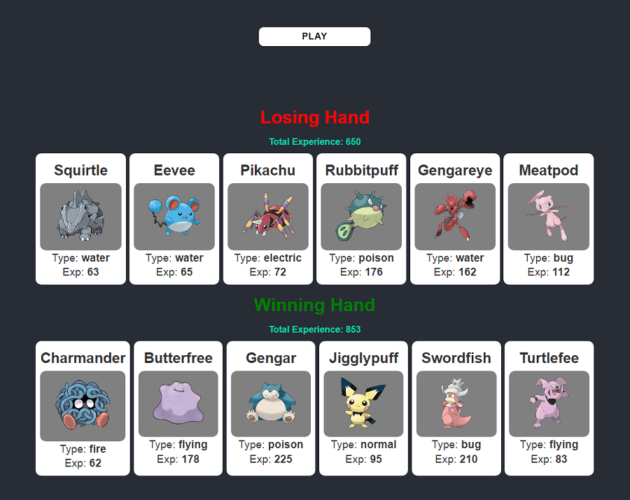

# Pokemondex App in React

Pokenondex App it is a create react app. It was created for desktop and mobile views. It displaying two groups of pokemons
with different attributes. One group is winnig depends of experience result. After clicking a button application is
drawing new groups of pokemons with different scores.

## Tools & Technology used

- Visual Studio Code
- React
- HTML
- CSS
- CSS modules
- Grid and Flexbox
